# Stellar Dev Track — Level 1 & Level 2 Submission

Two dApps built progressively on the **Stellar Testnet**: a peer-to-peer XLM payment app (Level 1), and a multi-wallet Soroban smart contract app with real-time on-chain event sync (Level 2).

🔗 **Live Demo (Level 1):** [https://stellar-neon-ten.vercel.app](https://stellar-neon-ten.vercel.app)
🔗 **Live Demo (Level 2):** `<add your Level 2 Vercel URL here>`
📁 **GitHub:** [https://github.com/arpandas2794/stellar](https://github.com/arpandas2794/stellar)

---

## 📚 Table of Contents

- [Level 1 — Stellar Pay (XLM Payment dApp)](#level-1--stellar-pay-xlm-payment-dapp)
- [Level 2 — OnChain Notes (Soroban Smart Contract dApp)](#level-2--onchain-notes-soroban-smart-contract-dapp)
- [Running Locally](#-running-locally)
- [Testnet Setup Guide](#-testnet-setup-guide)
- [License](#-license)

---

## Level 1 — Stellar Pay (XLM Payment dApp)

A simple, clean payment dApp that allows users to connect their Freighter wallet, view their XLM balance, and send XLM to any Stellar address — with full transaction feedback.

### ✅ Level 1 Requirements Checklist

| Requirement | Status |
|---|---|
| Freighter wallet setup | ✅ |
| Stellar Testnet configured | ✅ |
| Wallet connect functionality | ✅ |
| Wallet disconnect functionality | ✅ |
| Fetch XLM balance | ✅ |
| Display balance in UI | ✅ |
| Send XLM on Testnet | ✅ |
| Success state with transaction hash | ✅ |
| Failure / error state | ✅ |
| Clean UI + modular code structure | ✅ |

### 📸 Screenshots

| # | Screenshot | Description |
|---|---|---|
| 1 | 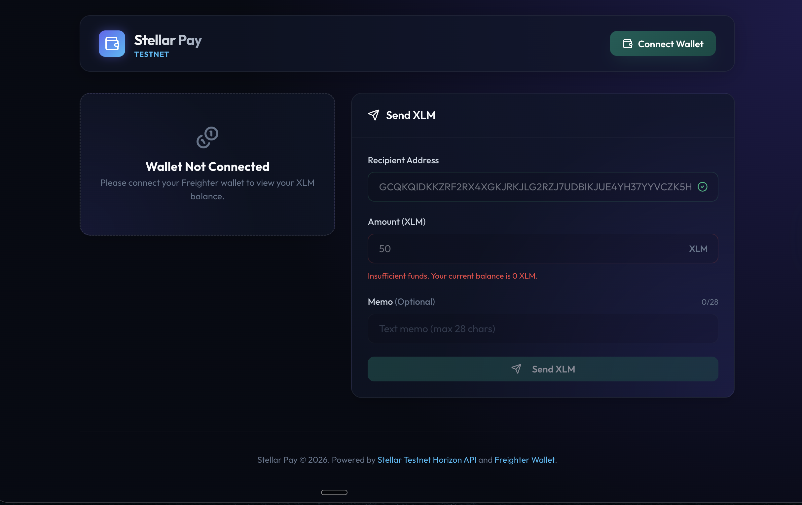 | Disconnected state — connect wallet prompt |
| 2 | 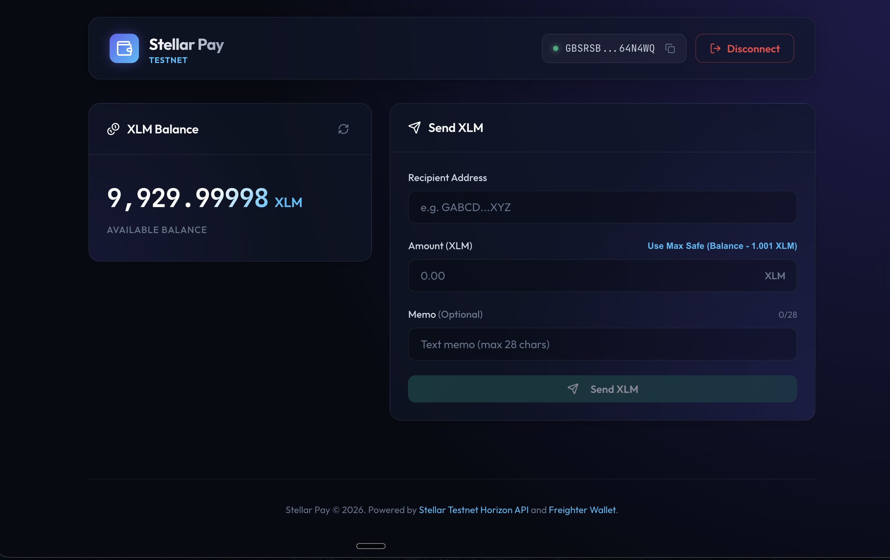 | Connected — wallet address + XLM balance |
| 3 | 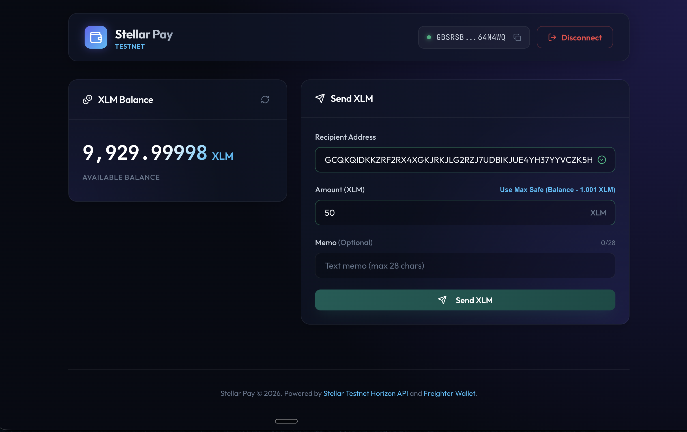 | Send form filled in |
| 4 | 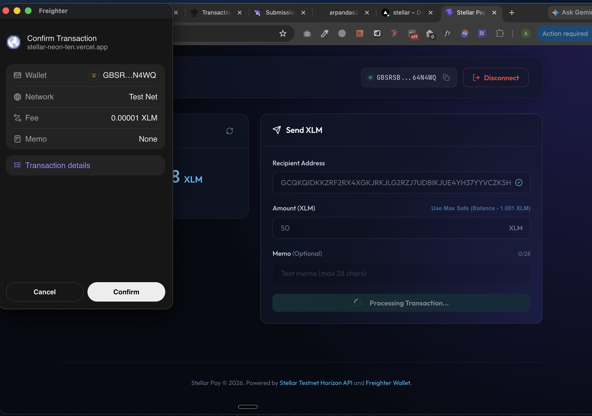 | Freighter signing popup |
| 5 | 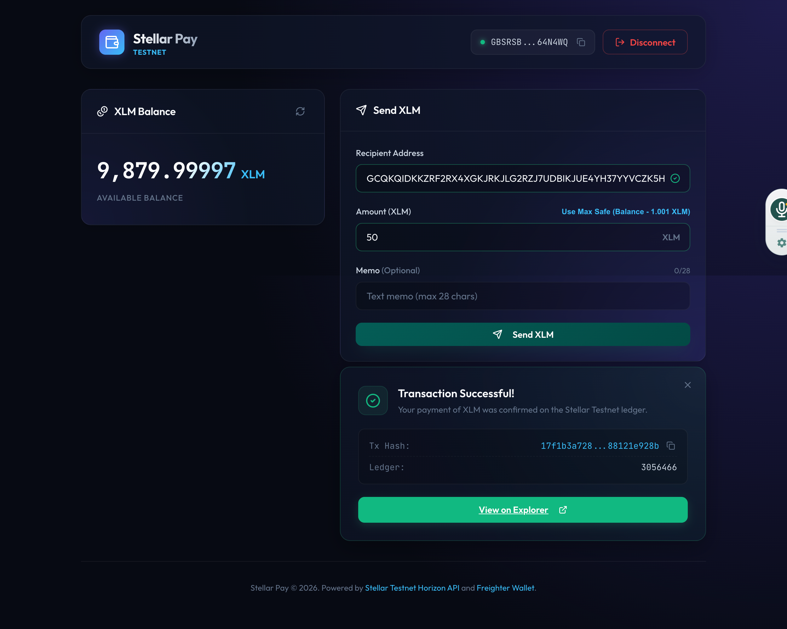 | Transaction success — hash displayed |
| 6 | 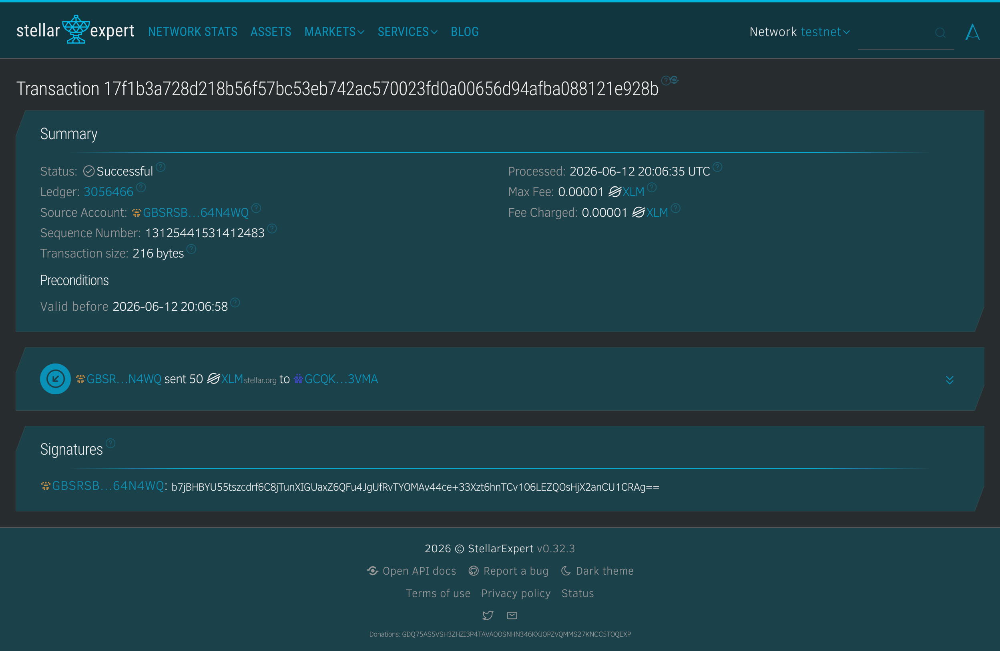 | Stellar Explorer — transaction confirmed |

### 🚀 Features

- **Wallet Connection** — Detects Freighter extension, connects/disconnects with one click, displays truncated public key
- **Balance Display** — Fetches live XLM balance from Horizon Testnet API and displays it prominently
- **Send XLM** — Full transaction flow: recipient address, amount, optional memo
- **Max Safe Amount** — Auto-calculates max sendable amount (balance minus 1.001 XLM reserve)
- **Transaction Feedback** — Success message with clickable transaction hash linking to Stellar Expert explorer
- **Error Handling** — Handles account not found, insufficient balance, invalid address, user rejection, and network errors

### 🛠 Tech Stack

| Tool | Purpose |
|---|---|
| React + Vite | Frontend framework |
| `@stellar/stellar-sdk` | Transaction building & Horizon API |
| `@stellar/freighter-api` | Wallet connect, sign transactions |
| Stellar Horizon Testnet | `https://horizon-testnet.stellar.org` |
| Vercel | Deployment |

### 📁 Project Structure

```
src/
├── components/
│   ├── WalletConnector.jsx     # Connect / disconnect wallet logic
│   ├── BalanceDisplay.jsx      # Fetch and display XLM balance
│   ├── SendForm.jsx            # Send XLM form with validation
│   └── TransactionResult.jsx  # Success / failure feedback UI
├── lib/
│   ├── stellar.js              # Transaction building & submission
│   └── freighter.js            # Wallet integration helpers
├── App.jsx
└── main.jsx
```

### ⚙️ How It Works

**Wallet Connection**
```js
import { getPublicKey } from "@stellar/freighter-api";
const publicKey = await getPublicKey();
```

**Balance Fetch**
```js
import { Horizon } from "@stellar/stellar-sdk";
const server = new Horizon.Server("https://horizon-testnet.stellar.org");
const account = await server.loadAccount(publicKey);
const balance = account.balances.find(b => b.asset_type === "native")?.balance;
```

**Send Transaction**
```js
import { TransactionBuilder, Networks, Operation, Asset, BASE_FEE } from "@stellar/stellar-sdk";
import { signTransaction } from "@stellar/freighter-api";

const sourceAccount = await server.loadAccount(senderPublicKey);
const tx = new TransactionBuilder(sourceAccount, {
  fee: BASE_FEE,
  networkPassphrase: Networks.TESTNET,
})
  .addOperation(Operation.payment({
    destination: recipientAddress,
    asset: Asset.native(),
    amount: amountString,
  }))
  .setTimeout(30)
  .build();

const signedXDR = await signTransaction(tx.toXDR(), { network: "TESTNET" });
const signedTx = TransactionBuilder.fromXDR(signedXDR, Networks.TESTNET);
const result = await server.submitTransaction(signedTx);
// result.hash → shown to user with explorer link
```

### 🔍 Live Transaction Example

Transaction confirmed on Stellar Testnet:
[`17f1b3a728d218b56f57bc53eb742ac570023fd0a00656d94afba088121e928b`](https://stellar.expert/explorer/testnet/tx/17f1b3a728d218b56f57bc53eb742ac570023fd0a00656d94afba088121e928b)

---

## Level 2 — OnChain Notes (Soroban Smart Contract dApp)

Level 2 builds directly on the Level 1 project and moves from simple peer-to-peer payments into **smart contract territory**: multi-wallet coordination, a deployed Soroban contract, real transaction status tracking, and real-time event-driven state sync. Instead of moving XLM from Account A to Account B, users connect any supported wallet, write a note, sign it, submit it to a custom on-chain contract, and watch a live feed update as events occur — including per-author ownership controls (delete) and a second write path (like).

### ✅ Level 2 Requirements Checklist

| Requirement | Status |
|---|---|
| Multi-wallet integration (Freighter, xBull, Albedo via StellarWalletsKit) | ✅ |
| 3+ distinct error types handled (wallet not found, user rejected, insufficient balance) | ✅ |
| Contract deployed on Testnet | ✅ |
| Contract called from the frontend (read + write) | ✅ |
| Transaction status visible (pending → success/fail) | ✅ |
| Real-time event listening & state sync | ✅ |
| **Bonus:** author-only delete with ownership enforcement | ✅ |
| **Bonus:** like-a-note with duplicate-like prevention | ✅ |
| **Bonus:** per-wallet note counter | ✅ |
| 2+ meaningful commits | ✅ |

### 📸 Screenshots

| # | Screenshot | Description |
|---|---|---|
| 1 | 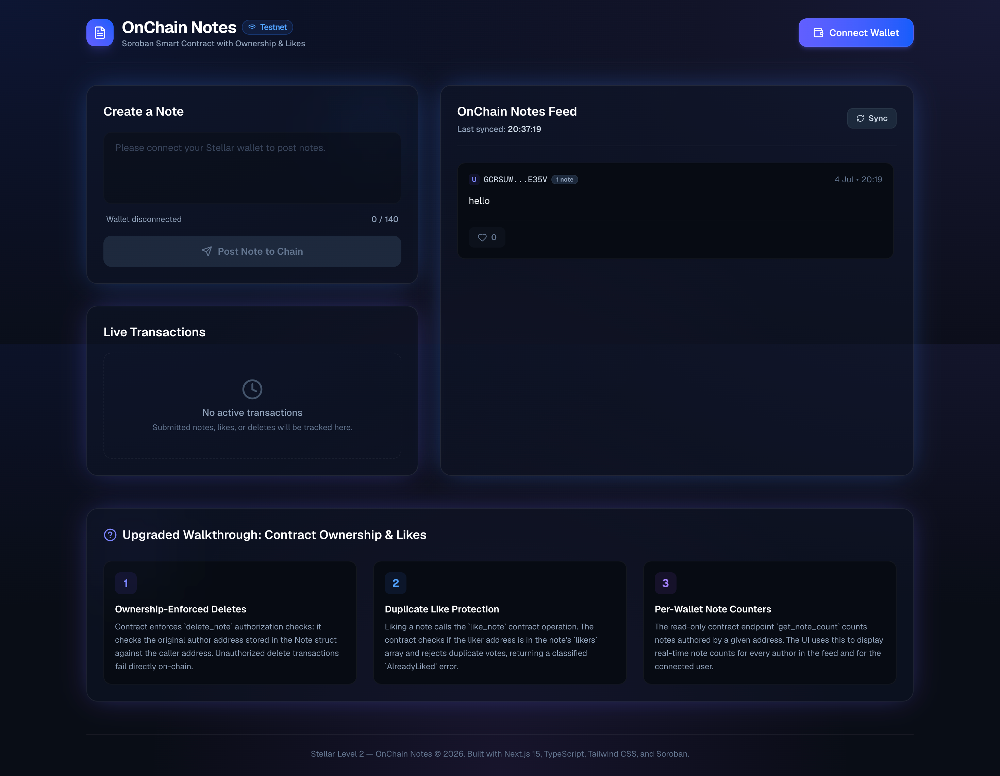 | Disconnected state — the dashboard view when no wallet is connected, showing the read-only notes feed and a prompt to connect |
| 2 | 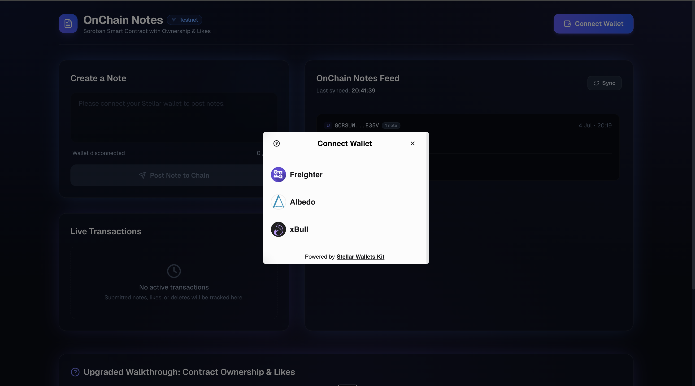 | StellarWalletsKit selection modal — the unified connection popup showing Freighter, Albedo, and xBull wallet modules |
| 3 | 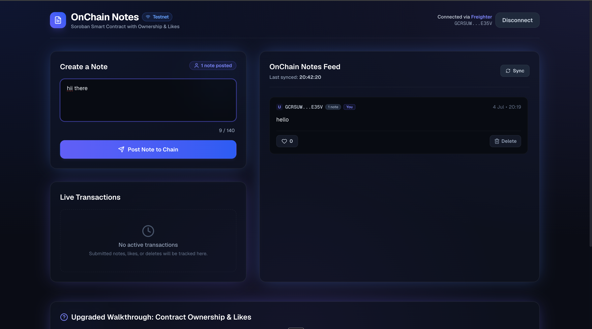 | Connected session — the active dashboard when authenticated via Freighter, with note composition enabled |
| 4 | 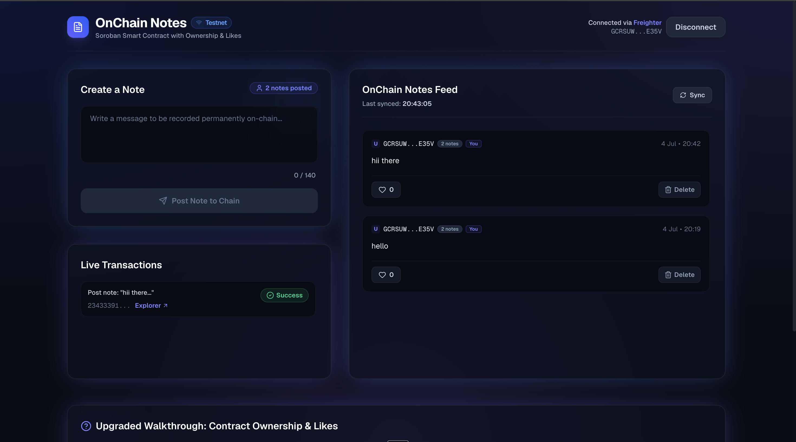 | Transaction status tracking — the live dashboard showing a completed `add_note` transaction marked as `Success` and the updated feed |
| 5 | 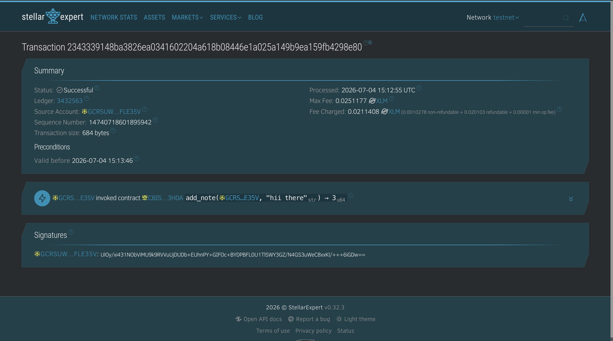 | Stellar Explorer verification — transaction details on Stellar.Expert confirming the on-chain `add_note` invocation |

> Note: for a fully bulletproof submission, consider adding a couple more shots alongside these — a triggered error state (wallet not found / rejected / insufficient balance), the delete/like actions in use, and two wallets syncing a note across sessions without a refresh. The five above already cover connection, deployment, writing, and status tracking end to end.

### 🏗️ Technical Architecture & Workflow

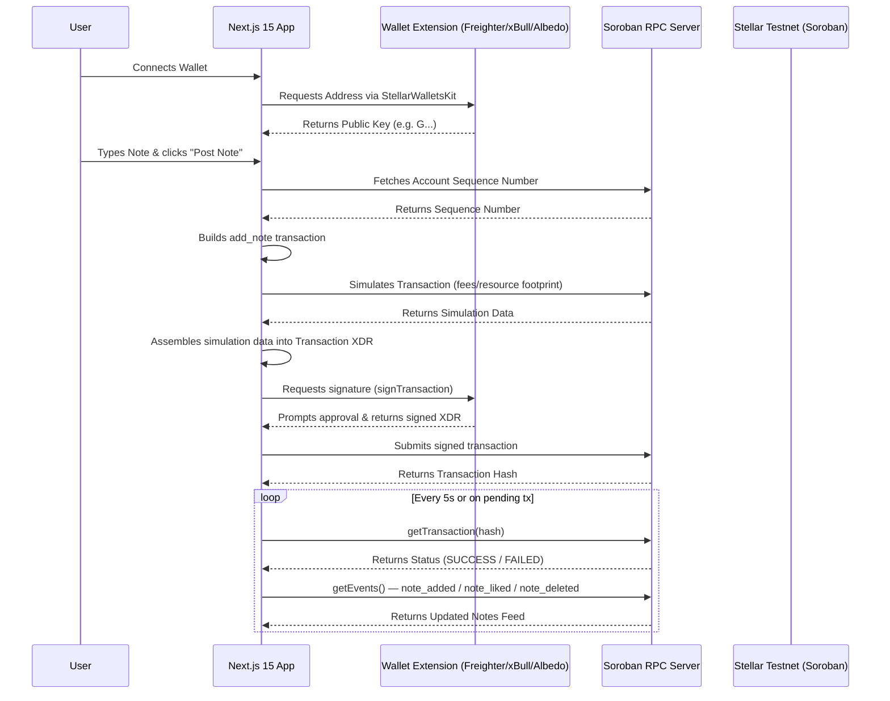

### 🔍 Key Components

**1. The Smart Contract (Rust / Wasm)** — `contracts/onchain_notes`

- **Storage** — `env.storage().persistent()` stores notes in a `Vec<Note>`, each with an auto-incrementing `id`, `author`, `message`, `likes`, and `timestamp`.
- **Authorization** — every write (`add_note`, `delete_note`, `like_note`) requires `author.require_auth()` or `liker.require_auth()`, cryptographically verifying the caller signed the transaction.
- **Ownership enforcement** — `delete_note` checks `note.author == caller` before allowing deletion, returning an `Unauthorized` contract error otherwise. This is real access control, not just "someone signed it."
- **Duplicate prevention** — `like_note` tracks which addresses already liked a note and returns an `AlreadyLiked` error on a repeat attempt.
- **Input validation** — rejects empty or over-140-character messages with a contract error.
- **Events** — emits `note_added`, `note_liked`, and `note_deleted` topics so the frontend can sync state without polling full account data.

**2. Multi-Wallet Integration** — `components/WalletProvider.tsx`

- **StellarWalletsKit** provides a single unified modal and signing API across Freighter, xBull, and Albedo instead of three separate integrations.
- **Auto-reconnect** via `localStorage` on page refresh, while still requiring an explicit signature for every write action.

**3. The Frontend Client (Next.js 15 + TypeScript)** — `lib/contract.ts`

- **Read simulation** (`fetchNotes`, `fetchNoteCount`) — read-only contract calls run as a local RPC simulation, no signature, no gas, no funded account required.
- **Write transaction** (`submitNote`, `deleteNote`, `likeNote`) — follows the full Soroban lifecycle: fetch sequence → build → simulate → assemble footprint/fee → sign → submit → poll.

**4. Real-Time Tracking & Polling**

- **Transaction status tracking** — the app never assumes success; it keeps a list of in-flight hashes and polls `getTransaction` until status resolves to `SUCCESS` or `FAILED`.
- **Sync polling** — every 5 seconds (and on tx confirmation) the app re-fetches the notes feed via `getEvents`, so notes posted by other wallets in other sessions appear without a page refresh.

**5. Error Classification** — `lib/errors.ts`

| Error type | Trigger | User-facing message |
|---|---|---|
| `WALLET_NOT_FOUND` | Selected wallet extension isn't installed | Prompts install (e.g. Chrome Web Store link) |
| `USER_REJECTED` | Signature declined in the wallet popup | "Transaction was rejected in your wallet" |
| `INSUFFICIENT_BALANCE` | Simulation/submission fails on an underfunded account | "Insufficient XLM balance" + Friendbot link |
| `NETWORK_ERROR` | Soroban RPC unreachable or timed out | "Network error, please try again" |
| `Unauthorized` (contract) | Attempting to delete another wallet's note | Blocked at the UI (delete button hidden) and defensively caught if called directly |
| `AlreadyLiked` (contract) | Liking the same note twice from one wallet | "You already liked this note" |

### ⭐ Bonus Features (beyond the base Level 2 requirements)

- **Author-only delete** — proves the contract enforces real ownership, not just valid signatures
- **Like a note** — a second state-mutating write path with its own event type, duplicate-like prevention, and live count
- **Per-wallet note counter** — a read-only `get_note_count` call surfaced both per-author in the feed and for the connected wallet

### 🛠 Tech Stack

| Tool | Purpose |
|---|---|
| Next.js 15 (App Router) + TypeScript | Frontend framework |
| Tailwind CSS | Styling |
| `@creit.tech/stellar-wallets-kit` | Unified multi-wallet connect + signing |
| `@stellar/stellar-sdk` | Contract calls, transaction building, RPC |
| Soroban (Rust → Wasm) | Smart contract |
| Stellar Soroban RPC (Testnet) | Simulation, submission, events |
| Vercel | Deployment |

### 📁 Project Structure

```
contracts/
└── onchain_notes/
    └── src/lib.rs           # add_note, delete_note, like_note, get_notes, get_note_count

src/
├── app/
│   ├── layout.tsx
│   └── page.tsx
├── components/
│   └── WalletProvider.tsx   # StellarWalletsKit context, connect/disconnect, auto-reconnect
├── lib/
│   ├── contract.ts          # submitNote, deleteNote, likeNote, fetchNotes, fetchNoteCount
│   └── errors.ts            # classifyStellarError
├── level_1_ss/               # Level 1 screenshots
└── level_2_ss/               # Level 2 screenshots
```

### 📜 Contract Details

| Field | Value |
|---|---|
| Contract name | `onchain_notes` |
| Network | Stellar Testnet |
| Contract ID | `<paste your deployed contract ID here>` |
| Deploy command | `stellar contract deploy --wasm target/.../onchain_notes.wasm --network testnet --source <key>` |

---

## 🧪 Running Locally

```bash
git clone https://github.com/arpandas2794/stellar.git
cd stellar
npm install
npm run dev
```

- **Level 1** runs on `http://localhost:5173` (Vite dev server)
- **Level 2** runs on `http://localhost:3000` (Next.js dev server)

Open in a browser where at least one supported wallet extension (Freighter, xBull, or Albedo) is installed.

## 🌐 Testnet Setup Guide

1. Install a supported wallet — [Freighter](https://freighter.app), xBull, or Albedo
2. Switch the wallet's network to **Testnet**
3. Copy your public key (`G...` address)
4. Fund it via Friendbot: `https://friendbot.stellar.org/?addr=YOUR_PUBLIC_KEY`
5. Open the app, click Connect Wallet, and start sending payments (Level 1) or posting notes (Level 2)

---

## 📄 License

MIT
