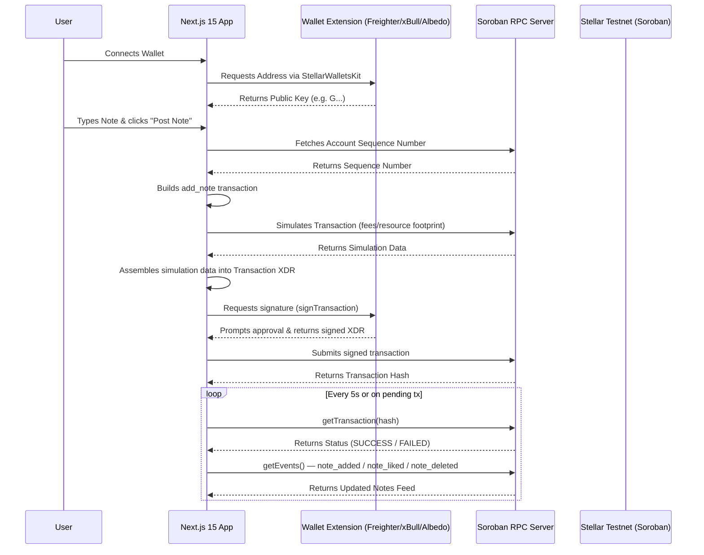
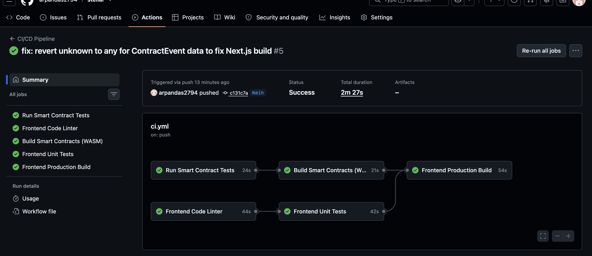
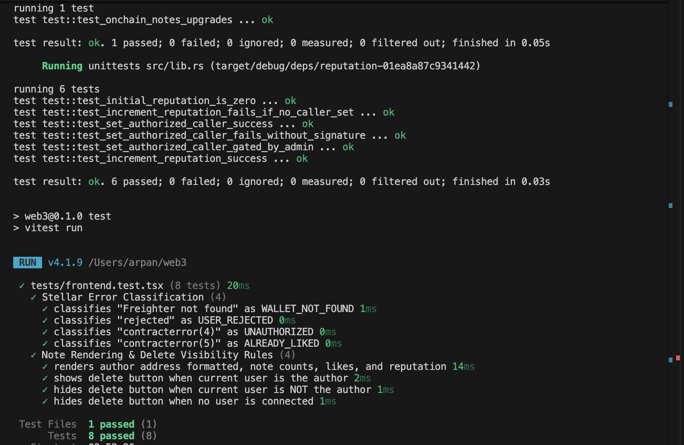
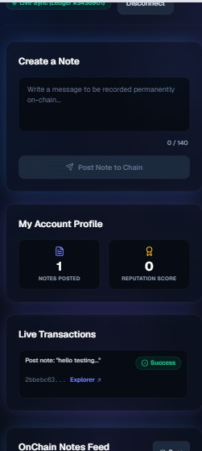
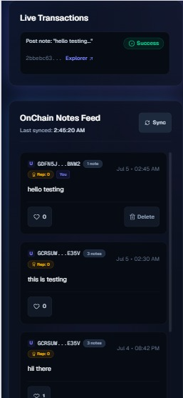
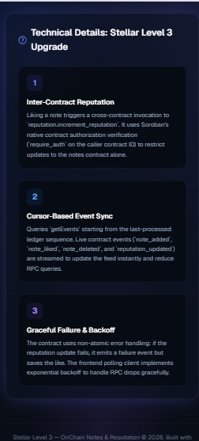
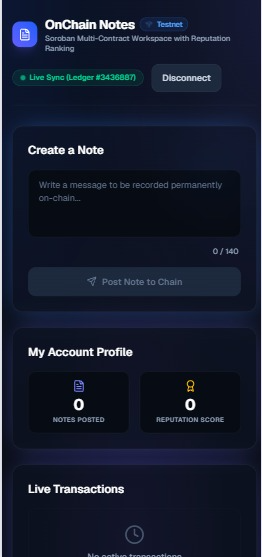
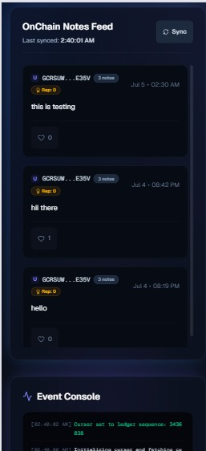
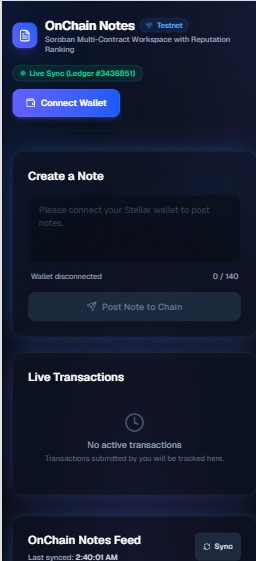

# Stellar Dev Track — Level 1, 2 & 3 Submission

[](https://github.com/arpandas2794/stellar/actions/workflows/ci.yml)
[](https://stellar.org)
[](https://nextjs.org)
[](https://www.typescriptlang.org)
[](https://soroban.stellar.org)
[](https://tailwindcss.com)
[](https://stellar-neon-ten.vercel.app)
[](#-testing)
[](#-license)

Three progressively advanced dApps built on the **Stellar Testnet**: a peer-to-peer XLM payment app (Level 1), a multi-wallet Soroban smart contract app with real-time event sync (Level 2), and a production-grade dApp with inter-contract communication, event streaming, CI/CD, and full test coverage (Level 3).

🔗 **Live Demo:** [https://stellar-neon-ten.vercel.app](https://stellar-neon-ten.vercel.app)
🎥 **Demo Video (Level 3):** [Watch on Google Drive](https://drive.google.com/file/d/1Fu3G9Pn9IqxYSRCSNHzi5d23oh52X0hO/view?usp=sharing)
📁 **GitHub:** [https://github.com/arpandas2794/stellar](https://github.com/arpandas2794/stellar)

---

## 📚 Table of Contents

- [Level 1 — Stellar Pay (XLM Payment dApp)](#level-1--stellar-pay-xlm-payment-dapp)
- [Level 2 — OnChain Notes (Soroban Smart Contract dApp)](#level-2--onchain-notes-soroban-smart-contract-dapp)
- [Level 3 — OnChain Notes + Reputation (Production-Ready dApp)](#level-3--onchain-notes--reputation-production-ready-dapp)
- [Running Locally](#-running-locally)
- [Testnet Setup Guide](#-testnet-setup-guide)
- [License](#-license)

---

## Level 1 — Stellar Pay (XLM Payment dApp)

 

A simple, clean payment dApp that allows users to connect their Freighter wallet, view their XLM balance, and send XLM to any Stellar address — with full transaction feedback.

### ✅ Level 1 Requirements Checklist

| Requirement | Status |
|---|---|
| Freighter wallet setup | ✅ |
| Stellar Testnet configured | ✅ |
| Wallet connect functionality | ✅ |
| Wallet disconnect functionality | ✅ |
| Fetch XLM balance | ✅ |
| Display balance in UI | ✅ |
| Send XLM on Testnet | ✅ |
| Success state with transaction hash | ✅ |
| Failure / error state | ✅ |
| Clean UI + modular code structure | ✅ |

### 📸 Screenshots

| # | Screenshot | Description |
|---|---|---|
| 1 |  | Disconnected state — connect wallet prompt |
| 2 |  | Connected — wallet address + XLM balance |
| 3 |  | Send form filled in |
| 4 |  | Freighter signing popup |
| 5 |  | Transaction success — hash displayed |
| 6 |  | Stellar Explorer — transaction confirmed |

### 🚀 Features

- **Wallet Connection** — Detects Freighter extension, connects/disconnects with one click, displays truncated public key
- **Balance Display** — Fetches live XLM balance from Horizon Testnet API and displays it prominently
- **Send XLM** — Full transaction flow: recipient address, amount, optional memo
- **Max Safe Amount** — Auto-calculates max sendable amount (balance minus 1.001 XLM reserve)
- **Transaction Feedback** — Success message with clickable transaction hash linking to Stellar Expert explorer
- **Error Handling** — Handles account not found, insufficient balance, invalid address, user rejection, and network errors

### 🛠 Tech Stack

| Tool | Purpose |
|---|---|
| React + Vite | Frontend framework |
| `@stellar/stellar-sdk` | Transaction building & Horizon API |
| `@stellar/freighter-api` | Wallet connect, sign transactions |
| Stellar Horizon Testnet | `https://horizon-testnet.stellar.org` |
| Vercel | Deployment |

### 📁 Project Structure

```
src/
├── components/
│   ├── WalletConnector.jsx     # Connect / disconnect wallet logic
│   ├── BalanceDisplay.jsx      # Fetch and display XLM balance
│   ├── SendForm.jsx            # Send XLM form with validation
│   └── TransactionResult.jsx  # Success / failure feedback UI
├── lib/
│   ├── stellar.js              # Transaction building & submission
│   └── freighter.js            # Wallet integration helpers
├── App.jsx
└── main.jsx
```

### ⚙️ How It Works

**Wallet Connection**
```js
import { getPublicKey } from "@stellar/freighter-api";
const publicKey = await getPublicKey();
```

**Balance Fetch**
```js
import { Horizon } from "@stellar/stellar-sdk";
const server = new Horizon.Server("https://horizon-testnet.stellar.org");
const account = await server.loadAccount(publicKey);
const balance = account.balances.find(b => b.asset_type === "native")?.balance;
```

**Send Transaction**
```js
import { TransactionBuilder, Networks, Operation, Asset, BASE_FEE } from "@stellar/stellar-sdk";
import { signTransaction } from "@stellar/freighter-api";

const sourceAccount = await server.loadAccount(senderPublicKey);
const tx = new TransactionBuilder(sourceAccount, {
  fee: BASE_FEE,
  networkPassphrase: Networks.TESTNET,
})
  .addOperation(Operation.payment({
    destination: recipientAddress,
    asset: Asset.native(),
    amount: amountString,
  }))
  .setTimeout(30)
  .build();

const signedXDR = await signTransaction(tx.toXDR(), { network: "TESTNET" });
const signedTx = TransactionBuilder.fromXDR(signedXDR, Networks.TESTNET);
const result = await server.submitTransaction(signedTx);
// result.hash → shown to user with explorer link
```

### 🔍 Live Transaction Example

Transaction confirmed on Stellar Testnet:
[`17f1b3a728d218b56f57bc53eb742ac570023fd0a00656d94afba088121e928b`](https://stellar.expert/explorer/testnet/tx/17f1b3a728d218b56f57bc53eb742ac570023fd0a00656d94afba088121e928b)

---

## Level 2 — OnChain Notes (Soroban Smart Contract dApp)

 

Level 2 builds directly on the Level 1 project and moves from simple peer-to-peer payments into **smart contract territory**: multi-wallet coordination, a deployed Soroban contract, real transaction status tracking, and real-time event-driven state sync. Instead of moving XLM from Account A to Account B, users connect any supported wallet, write a note, sign it, submit it to a custom on-chain contract, and watch a live feed update as events occur — including per-author ownership controls (delete) and a second write path (like).

### ✅ Level 2 Requirements Checklist

| Requirement | Status |
|---|---|
| Multi-wallet integration (Freighter, xBull, Albedo via StellarWalletsKit) | ✅ |
| 3+ distinct error types handled (wallet not found, user rejected, insufficient balance) | ✅ |
| Contract deployed on Testnet | ✅ |
| Contract called from the frontend (read + write) | ✅ |
| Transaction status visible (pending → success/fail) | ✅ |
| Real-time event listening & state sync | ✅ |
| **Bonus:** author-only delete with ownership enforcement | ✅ |
| **Bonus:** like-a-note with duplicate-like prevention | ✅ |
| **Bonus:** per-wallet note counter | ✅ |
| 2+ meaningful commits | ✅ |

### 📸 Screenshots

| # | Screenshot | Description |
|---|---|---|
| 1 |  | Disconnected state — the dashboard view when no wallet is connected, showing the read-only notes feed and a prompt to connect |
| 2 |  | StellarWalletsKit selection modal — the unified connection popup showing Freighter, Albedo, and xBull wallet modules |
| 3 |  | Connected session — the active dashboard when authenticated via Freighter, with note composition enabled |
| 4 |  | Transaction status tracking — the live dashboard showing a completed `add_note` transaction marked as `Success` and the updated feed |
| 5 |  | Stellar Explorer verification — transaction details on Stellar.Expert confirming the on-chain `add_note` invocation |

### 🏗️ Technical Architecture & Workflow



### 🔍 Key Components

**1. The Smart Contract (Rust / Wasm)** — `contracts/onchain_notes`

- **Storage** — `env.storage().persistent()` stores notes in a `Vec<Note>`, each with an auto-incrementing `id`, `author`, `message`, `likes`, and `timestamp`.
- **Authorization** — every write (`add_note`, `delete_note`, `like_note`) requires `author.require_auth()` or `liker.require_auth()`, cryptographically verifying the caller signed the transaction.
- **Ownership enforcement** — `delete_note` checks `note.author == caller` before allowing deletion, returning an `Unauthorized` contract error otherwise. This is real access control, not just "someone signed it."
- **Duplicate prevention** — `like_note` tracks which addresses already liked a note and returns an `AlreadyLiked` error on a repeat attempt.
- **Input validation** — rejects empty or over-140-character messages with a contract error.
- **Events** — emits `note_added`, `note_liked`, and `note_deleted` topics so the frontend can sync state without polling full account data.

**2. Multi-Wallet Integration** — `components/WalletProvider.tsx`

- **StellarWalletsKit** provides a single unified modal and signing API across Freighter, xBull, and Albedo instead of three separate integrations.
- **Auto-reconnect** via `localStorage` on page refresh, while still requiring an explicit signature for every write action.

**3. The Frontend Client (Next.js 15 + TypeScript)** — `lib/contract.ts`

- **Read simulation** (`fetchNotes`, `fetchNoteCount`) — read-only contract calls run as a local RPC simulation, no signature, no gas, no funded account required.
- **Write transaction** (`submitNote`, `deleteNote`, `likeNote`) — follows the full Soroban lifecycle: fetch sequence → build → simulate → assemble footprint/fee → sign → submit → poll.

**4. Real-Time Tracking & Polling**

- **Transaction status tracking** — the app never assumes success; it keeps a list of in-flight hashes and polls `getTransaction` until status resolves to `SUCCESS` or `FAILED`.
- **Sync polling** — every 5 seconds (and on tx confirmation) the app re-fetches the notes feed via `getEvents`, so notes posted by other wallets in other sessions appear without a page refresh.

**5. Error Classification** — `lib/errors.ts`

| Error type | Trigger | User-facing message |
|---|---|---|
| `WALLET_NOT_FOUND` | Selected wallet extension isn't installed | Prompts install (e.g. Chrome Web Store link) |
| `USER_REJECTED` | Signature declined in the wallet popup | "Transaction was rejected in your wallet" |
| `INSUFFICIENT_BALANCE` | Simulation/submission fails on an underfunded account | "Insufficient XLM balance" + Friendbot link |
| `NETWORK_ERROR` | Soroban RPC unreachable or timed out | "Network error, please try again" |
| `Unauthorized` (contract) | Attempting to delete another wallet's note | Blocked at the UI (delete button hidden) and defensively caught if called directly |
| `AlreadyLiked` (contract) | Liking the same note twice from one wallet | "You already liked this note" |

### ⭐ Bonus Features (beyond the base Level 2 requirements)

- **Author-only delete** — proves the contract enforces real ownership, not just valid signatures
- **Like a note** — a second state-mutating write path with its own event type, duplicate-like prevention, and live count
- **Per-wallet note counter** — a read-only `get_note_count` call surfaced both per-author in the feed and for the connected wallet

### 🛠 Tech Stack

| Tool | Purpose |
|---|---|
| Next.js 15 (App Router) + TypeScript | Frontend framework |
| Tailwind CSS | Styling |
| `@creit.tech/stellar-wallets-kit` | Unified multi-wallet connect + signing |
| `@stellar/stellar-sdk` | Contract calls, transaction building, RPC |
| Soroban (Rust → Wasm) | Smart contract |
| Stellar Soroban RPC (Testnet) | Simulation, submission, events |
| Vercel | Deployment |

### 📜 Level 2 Contract Details

| Field | Value |
|---|---|
| Contract name | `onchain_notes` |
| Network | Stellar Testnet |
| Contract ID | `<paste your deployed contract ID here>` |
| Deploy command | `stellar contract deploy --wasm target/.../onchain_notes.wasm --network testnet --source <key>` |

---

## Level 3 — OnChain Notes + Reputation (Production-Ready dApp)

  

Level 3 turns the project from a working demo into a **production-grade dApp**: a second Soroban contract (`reputation`) that `onchain_notes` calls into directly (true inter-contract communication), a cursor-based real-time event stream across both contracts, a full CI/CD pipeline running contract and frontend tests on every push, a mobile-responsive UI, and complete test coverage on both the Rust and TypeScript sides.

### ✅ Level 3 Requirements Checklist

| Requirement | Status |
|---|---|
| Advanced smart contract development | ✅ |
| Inter-contract communication | ✅ |
| Event streaming & real-time updates | ✅ |
| CI/CD pipeline setup | ✅ |
| Smart contract deployment workflow | ✅ |
| Mobile responsive frontend | ✅ |
| Error handling & loading states | ✅ |
| Tests for contracts and frontend | ✅ |
| Production-ready architecture practices | ✅ |
| Documentation & demo presentation | ✅ |
| Public GitHub repository | ✅ |
| README with complete documentation | ✅ |
| 10+ meaningful commits | ✅ |
| Live demo link | ✅ |
| Contract deployment address | ✅ |
| Transaction hash for contract interaction | ✅ |
| Demo video (1–2 min) | ✅ |

### 📸 Screenshots

| # | Screenshot | Description |
|---|---|---|
| 1 |  | A fully automated multi-stage GitHub Actions CI/CD pipeline validating Rust smart contract tests and the Next.js frontend build on every push |
| 2 |  | Terminal output showing 7 passing Rust smart contract unit tests (across `onchain_notes` and `reputation`) plus 8 passing Vitest frontend tests |
| 3 |  | The UI showing a pending in-flight transaction as a user submits a new on-chain note to the Soroban network |
| 4 |  | Real-time feedback during a cross-contract invocation — liking a note triggers a call into the `reputation` contract, bumping the author's on-chain score |
| 5 |  | The cursor-based event streaming system detecting ledger confirmation and updating the UI feed live, with no page refresh |
| 6 |  | Mobile-responsive dashboard after a successful wallet connection, showing the live notes feed and user stats stacked for small screens |
| 7 |  | Mobile view highlighting the connected wallet's note count and cross-contract reputation score |
| 8 |  | Mobile-responsive public view of the feed before connecting a wallet, with graceful read-only state handling |

### 🏗️ What's New — Inter-Contract Communication

Level 3 introduces a second contract, `reputation`, that `onchain_notes` calls **directly on-chain** rather than the frontend orchestrating two separate calls:

1. When a user likes a note, `onchain_notes::like_note` records the like, then makes a **cross-contract call** into `reputation::increment_reputation`, passing the note's author as the target.
2. The `reputation` contract only accepts calls from `onchain_notes`'s specific contract address — set once via an admin-gated `set_authorized_caller` function — so this is genuine contract-to-contract authorization, not just "any signed wallet can bump anyone's score."
3. `reputation::get_reputation` is exposed as a read-only call so the frontend can display each author's score without a signature.

This is what makes the "cross-contract invocation" screenshot meaningful — the like transaction and the reputation update happen atomically as part of one signed transaction, verifiable on Stellar Expert.

### 🔄 Event Streaming & Real-Time Updates

- Replaced the flat interval poll with a **cursor-based event stream**: the app tracks the last-seen ledger sequence and only fetches events after that cursor via `getEvents`, merging new events into state instead of refetching everything.
- A single unified stream handles events from **both contracts** — `note_added`, `note_liked`, `note_deleted` from `onchain_notes`, and `reputation_updated` from `reputation` — rendered as one live activity feed.
- Includes reconnect/backoff handling so a dropped RPC call retries gracefully instead of failing silently, with a visible "live" vs "reconnecting" status indicator.

### 🧪 Testing

**Contract tests (Rust, `cargo test --workspace`)** — 7 tests passing:
- `onchain_notes`: upgrade/regression coverage for the existing add/delete/like flow
- `reputation`: initial reputation is zero, increment fails without an authorized caller set, `set_authorized_caller` succeeds/fails correctly under admin gating, and `increment_reputation` succeeds end-to-end

**Frontend tests (Vitest + React Testing Library, `npm test`)** — 8 tests passing:
- Stellar error classification (4 tests) — confirms `WALLET_NOT_FOUND`, `USER_REJECTED`, `UNAUTHORIZED`, and `ALREADY_LIKED` are each classified correctly from raw error strings/contract error codes
- Note rendering & delete visibility rules (4 tests) — confirms author formatting/counts render correctly, and the delete button only appears for the connected wallet's own notes

### ⚙️ CI/CD Pipeline

`.github/workflows/ci.yml` runs on every push and pull request with two jobs:
- **Rust Smart Contracts** — installs the Rust toolchain, runs `cargo test --workspace` across both contract crates, and builds the Wasm targets
- **Frontend (Next.js)** — installs dependencies, lints, runs `npm test`, and runs `npm run build` to confirm a clean production build

Both jobs must pass for the pipeline to go green; a failing contract or frontend test blocks the pipeline rather than passing silently.

### 📱 Mobile Responsiveness

All core screens — wallet connect, note composition, live transactions, and the notes feed — were audited and rebuilt for mobile breakpoints (375px/390px), converting the desktop two-column layout into a stacked single-column layout with touch-friendly tap targets below the `md:` breakpoint.

### 🛡️ Production Architecture Practices

- No private keys or secrets in frontend code — all signing happens wallet-side
- Centralized config module for contract IDs, RPC URLs, and network settings instead of scattered `process.env` calls
- RPC call throttling to avoid spamming the Soroban endpoint on rapid UI interactions
- Top-level error boundary so an unexpected frontend error doesn't blank the whole app
- Explicit loading states on every async operation (feed fetch, wallet connect, transaction pending, reputation fetch)

### 🛠 Tech Stack (additions over Level 2)

| Tool | Purpose |
|---|---|
| Soroban (Rust) — `reputation` contract | Inter-contract reputation scoring |
| `soroban-sdk` testutils | Rust contract unit testing |
| Vitest + React Testing Library | Frontend unit/component testing |
| GitHub Actions | CI/CD pipeline (contract + frontend) |

### 📁 Project Structure (updated)

```
contracts/
├── onchain_notes/
│   └── src/lib.rs           # add_note, delete_note, like_note, get_notes, get_note_count
└── reputation/
    └── src/lib.rs            # increment_reputation, get_reputation, set_authorized_caller

.github/
└── workflows/
    └── ci.yml                # Rust + frontend CI pipeline

src/
├── app/
│   ├── layout.tsx
│   └── page.tsx
├── components/
│   └── WalletProvider.tsx    # StellarWalletsKit context, connect/disconnect, auto-reconnect
├── lib/
│   ├── contract.ts           # submitNote, deleteNote, likeNote, fetchNotes, fetchNoteCount, fetchReputation
│   └── errors.ts             # classifyStellarError
├── level_1_ss/                # Level 1 screenshots
├── level_2_ss/                # Level 2 screenshots
└── level_3_ss/                # Level 3 screenshots

tests/
└── frontend.test.tsx          # Vitest + React Testing Library suite
```

### 📜 Level 3 Contract Details

| Field | Value |
|---|---|
| `onchain_notes` Contract ID | `<paste your deployed onchain_notes contract ID here>` |
| `reputation` Contract ID | `<paste your deployed reputation contract ID here>` |
| Network | Stellar Testnet |
| Sample transaction hash (`like_note` → cross-contract call) | `<paste a confirmed transaction hash here>` |
| View on Stellar Expert | `https://stellar.expert/explorer/testnet/tx/<your tx hash>` |

### 🎥 Demo Video

A 1–2 minute walkthrough covering wallet connection, posting a note, liking a note (with the live reputation bump), deleting a note, mobile view, and the CI pipeline passing:

[Watch the Level 3 demo video](https://drive.google.com/file/d/1Fu3G9Pn9IqxYSRCSNHzi5d23oh52X0hO/view?usp=sharing)

---

## 🧪 Running Locally

```bash
git clone https://github.com/arpandas2794/stellar.git
cd stellar
npm install
npm run dev
```

- **Level 1** runs on `http://localhost:5173` (Vite dev server)
- **Level 2 & 3** run on `http://localhost:3000` (Next.js dev server)

Run contract tests: `cargo test --workspace`
Run frontend tests: `npm test`

Open in a browser where at least one supported wallet extension (Freighter, xBull, or Albedo) is installed.

## 🌐 Testnet Setup Guide

1. Install a supported wallet — [Freighter](https://freighter.app), xBull, or Albedo
2. Switch the wallet's network to **Testnet**
3. Copy your public key (`G...` address)
4. Fund it via Friendbot: `https://friendbot.stellar.org/?addr=YOUR_PUBLIC_KEY`
5. Open the app, click Connect Wallet, and start sending payments (Level 1), posting notes (Level 2), or liking notes to build reputation (Level 3)

---

## 📄 License

MIT
